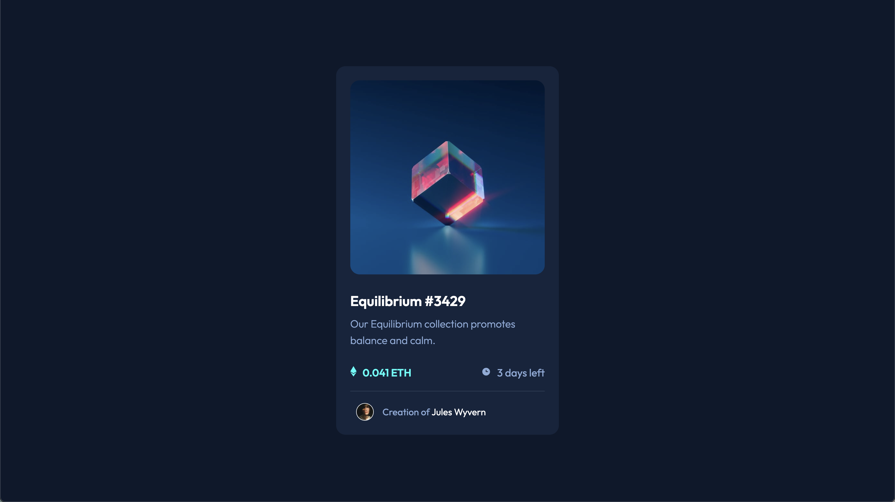

# Frontend Mentor - NFT preview card component

This is a solution to the [NFT preview card component challenge on Frontend Mentor](https://www.frontendmentor.io/challenges/nft-preview-card-component-SbdUL_w0U). Frontend Mentor challenges help you improve your coding skills by building realistic projects.

## Table of contents

- [Overview](#overview)
  - [The challenge](#the-challenge)
  - [Screenshot](#screenshot)
  - [Links](#links)
- [Author](#author)

## Overview

### The challenge

Users should be able to:

- View the optimal layout depending on their device's screen size
- See hover states for interactive elements

### Screenshot

### Links

- Solution URL: [Click to visit](https://www.frontendmentor.io/solutions/nftpreviewcardcomponent-using-flexbox-k4uL_TEwZ_)
- Live Site URL: [Click to visit](https://imadosan.github.io/nft-preview-card-component/)

## Author

- Frontend Mentor - [@imadosan](https://www.frontendmentor.io/profile/imadosan)
